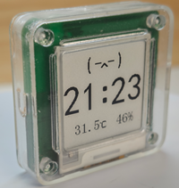
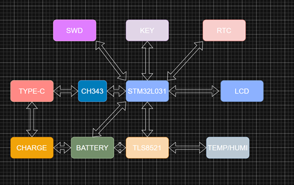

# 探索版小米温湿度计

## 1 项目概述
本项目基于小米温湿度计2代进行，在吸收了3代和pro版本的优势后，整合为一个探索版本。

## 2 系统框图

## 3 功能介绍
### 3.1 基础功能
* 基础功能与官方小米温湿度计2代完全一致
### 3.2 新增功能
* 添加了3代中的实现显示与按键控制
* 添加了pro版本中的墨水屏功能

## 4 原理解析
在官方的原始设计中，设备的主控为TLS8251,屏幕驱动为一颗定制芯片，屏幕驱动与TLS8251之间通过I2C通信。在我的新设计中，使用STM32L031代替屏幕驱动芯片。在其固件中兼容了原有的显示驱动，同时实现了墨水屏，按键，时钟的驱动。

## 5 工程目录结构
* 3d-model:结构件3D打印使用的STL文件
* hardware:原理图，PCB位号图，PCB生产使用的gerber文件，以及物料列表和系统框图(查看工具https://app.diagrams.net/)
* image:工程使用的各种图片文件
* source_code:STM32L031的固件源文件，另外在工厂的release中存放了最新发布的固件
* tools:用来进行时间同步的html源码，通过浏览器打开即可使用

